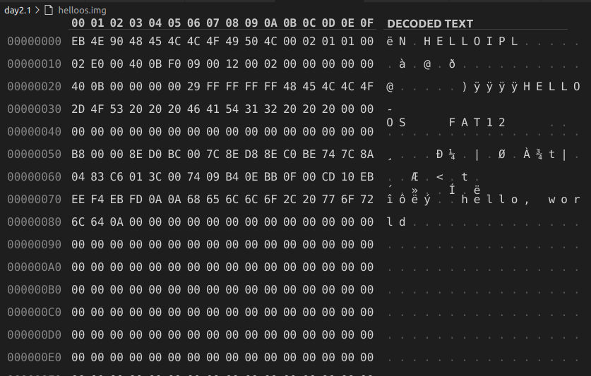
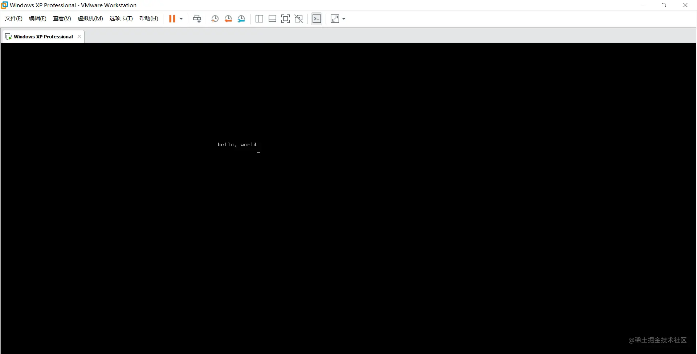
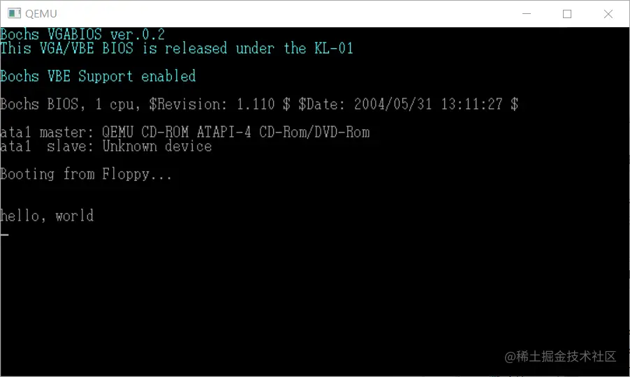

# 第一天

当然，老实说这也算不上第一天，在一个星期以前我已经把这本书翻了一遍，在忙完了手中的事情后，也打算认真的实验一遍。

这本书虽然名字叫着30天自制操作系统，但事实上在这30天之前你需要有一些知识的沉淀，如果没有的话，或许要得多一段时间吧。

我也把书中的光盘文件上传到了github，链接：[github.com/imangoa/os](https://link.juejin.cn/?target=https%3A%2F%2Fgithub.com%2Fimangoa%2Fos)。嗯，如果要看书的话，我建议到微信读书里，用不完的体验卡，哈哈。

## 编写hello world

书中要完成的第一个任务就是在打开电源时显示 hello world，就像我们以前学习一门新语言一样。

而在这本书地第一章，提供了三种方式去完成这个。当然，这三种方式也是殊途同归。

第一种是通过编辑二进制的方式，按照作者给的二进制值输入，最后把文件后缀改为.img。当然，作者也没打算我们真的这么去做，以这种诙谐的手法，可能是旨在告诉读者一切程序都由二进制构成。

第一种太长了，就不写下来了，放个截图。感兴趣的伙伴可以用二进制编辑器打开镜像文件直接查看。



第二种使用的是汇编，不过是使用汇编的RESB标识符和DB标识符进行写二进制值，RESB符填充了为00的二进制位。本质上与第一种方式并没有区别。

``` assembly
DB	0xeb, 0x4e, 0x90, 0x48, 0x45, 0x4c, 0x4c, 0x4f
DB	0x49, 0x50, 0x4c, 0x00, 0x02, 0x01, 0x01, 0x00
DB	0x02, 0xe0, 0x00, 0x40, 0x0b, 0xf0, 0x09, 0x00
DB	0x12, 0x00, 0x02, 0x00, 0x00, 0x00, 0x00, 0x00
DB	0x40, 0x0b, 0x00, 0x00, 0x00, 0x00, 0x29, 0xff
DB	0xff, 0xff, 0xff, 0x48, 0x45, 0x4c, 0x4c, 0x4f
DB	0x2d, 0x4f, 0x53, 0x20, 0x20, 0x20, 0x46, 0x41
DB	0x54, 0x31, 0x32, 0x20, 0x20, 0x20, 0x00, 0x00
RESB	16
DB	0xb8, 0x00, 0x00, 0x8e, 0xd0, 0xbc, 0x00, 0x7c
DB	0x8e, 0xd8, 0x8e, 0xc0, 0xbe, 0x74, 0x7c, 0x8a
DB	0x04, 0x83, 0xc6, 0x01, 0x3c, 0x00, 0x74, 0x09
DB	0xb4, 0x0e, 0xbb, 0x0f, 0x00, 0xcd, 0x10, 0xeb
DB	0xee, 0xf4, 0xeb, 0xfd, 0x0a, 0x0a, 0x68, 0x65
DB	0x6c, 0x6c, 0x6f, 0x2c, 0x20, 0x77, 0x6f, 0x72
DB	0x6c, 0x64, 0x0a, 0x00, 0x00, 0x00, 0x00, 0x00
RESB	368
DB	0x00, 0x00, 0x00, 0x00, 0x00, 0x00, 0x55, 0xaa
DB	0xf0, 0xff, 0xff, 0x00, 0x00, 0x00, 0x00, 0x00
RESB	4600
DB	0xf0, 0xff, 0xff, 0x00, 0x00, 0x00, 0x00, 0x00
RESB	1469432 
```

第三种方式也是通过汇编，与第一种和第二种并无本质区别。其实也就是第二种方式上把代码整理的更符合人类编码方式，知其然，知其所以然。第三种就是知其所以然吧。老规矩，上代码。

``` assembly
; hello-os
; TAB=4

; 以下这段是标准FAT12格式软盘专用代码
DB		0xeb, 0x4e, 0x90
DB		"HELLOIPL"		; 启动区的名称可以是任意的字符串(8字节)
DW		512				; 每个扇区的大小（必须是512字节）
DB		1				; 簇的大小（必须为1扇区）
DW		1				; FAT的起始位置（一般从第一个扇区开始）
DB		2				; FAT的个数（必须为而）
DW		224				; 根目录的大小（一般设成224项）
DW		2880			; 该磁盘的大小（必须是2880扇区）
DB		0xf0			; 磁盘的种类（必须是0xf0）
DW		9				; FAT的长度（必须是9扇区）
DW		18				; 1个磁道有几个扇区（必须是18）
DW		2				; 磁头数（必须是2）
DD		0				; 不使用分区，必须是0
DD		2880			; 重写一次磁盘的大小
DB		0,0,0x29		; 意义不明，固定
DD		0xffffffff		; （可能是）卷标号码
DB		"HELLO-OS   "	; 磁盘的名称（11字节）
DB		"FAT12   "		; 磁盘格式名称（8字节）
RESB	18				; 先空出18字节

; 程序本体
DB		0xb8, 0x00, 0x00, 0x8e, 0xd0, 0xbc, 0x00, 0x7c
DB		0x8e, 0xd8, 0x8e, 0xc0, 0xbe, 0x74, 0x7c, 0x8a
DB		0x04, 0x83, 0xc6, 0x01, 0x3c, 0x00, 0x74, 0x09
DB		0xb4, 0x0e, 0xbb, 0x0f, 0x00, 0xcd, 0x10, 0xeb
DB		0xee, 0xf4, 0xeb, 0xfd

; 信息显示部分
DB		0x0a, 0x0a		; 两个换行
DB		"hello, world"
DB		0x0a			; 换行
DB		0

RESB	0x1fe-$			; 填写0xoo，直到0x001fe

DB		0x55, 0xaa

; 以下是启动区以外部分的输出
DB		0xf0, 0xff, 0xff, 0x00, 0x00, 0x00, 0x00, 0x00
RESB	4600
DB		0xf0, 0xff, 0xff, 0x00, 0x00, 0x00, 0x00, 0x00
RESB	1469432
```

**当然，虽然是三种方法，但其实本质都和第一种是一样的。都只是在排列二进制位。**

## 运行hello world

很巧的是运行也有三种方法，第一种是在QEMU仿真器上运行，第二种是可以通过在vmware上面的软盘挂载运行，第三种是可以通过把img写入到U盘上，插入到真机上u盘启动运行。QEMU上运行会比较简单，而在真机上运行成就感或许会大。**所以，我选在VMware上运行，哈哈！**

放一波截图吧，hh

VMware运行





QEMU运行

``` bash
qemu-system-i386 -drive file=myos.img,if=floppy
```




**一波操作下来，第一天也就完成了！至于怎么在VMware上运行和真机上运行，可以百度搜索一下。我就不做教程的搬运工了**