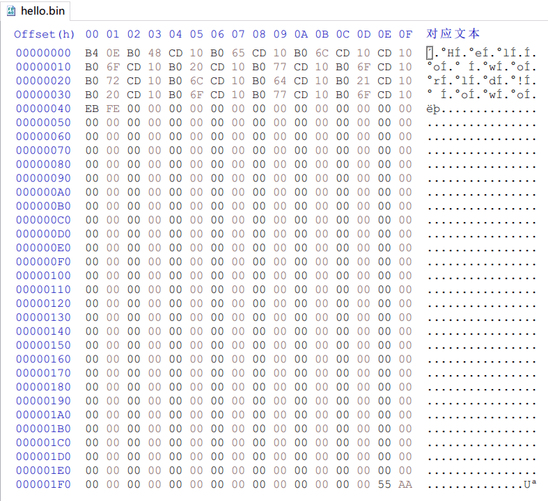

## [使用汇编语言触发BIOS中断INT 0x10进行屏幕输出](https://zoxoy.club/post/Print-char-by-INT-0x10/)

### 用汇编写一个Hello World程序并在虚拟机里运行

Feb 19, 2021

阅读时长: 1 分钟

# 配置环境

本文用到了以下工具：

- 汇编语言编译器（nasm）
- 文本编辑器（VS Code）
- 虚拟机软件（VMWare）
- 16进制编辑器（HxD）

## nasm

前往nasm官网(https://www.nasm.us/)下载对应系统版本的程序并安装。

安装完成后，将nasm的程序路径添加到系统环境变量中。

# 理论

## 主引导记录MBR

计算机的BIOS完成POST上电自检之后，会在已连接到计算机的设备中寻找可启动的设备。

BIOS首先会检查设备的MBR是否有效，主引导记录MBR(Master Boot Record)位于磁盘的第一个扇区，也就是0柱面，0磁头，1扇区，一共占用512字节。

主引导记录由三个部分组成：引导程序占用其中的前446字节（偏移0～1BDH），随后的64字节（偏移1BEH～1FDH）为DPT（Disk Partition Table，硬盘分区表），最后的两个字节“55 AA”（偏移1FEH～1FFH）是结束标志。

BIOS判断MBR是否有效的标志就是MBR的最后两个字节也就是511和512字节是否为`0x55 0xaa`，如果是，则MBR有效，BIOS就会从0扇区的起始部分开始执行启动代码；如果不是，则不会启动，并提示没有启动设备。

## 屏幕输出

BIOS中断INT 0x10有很多不同的功能，各个功能的入口是通过CPU寄存器AH的值来决定的，比如在Teletype模式下显示字符的功能号就是`0E`。

功能号：`0EH`

功能：在Teletype模式下显示字符

入口参数：

- AH＝`0EH`
- AL＝字符
- BH＝页码
- BL＝前景色(图形模式)

出口参数： 无

使用方法：

使用移位mov指令将16进制数`0x0E`移至CPU寄存器AH上，将要显示的字符移至CPU寄存器AL上，然后再通过`int 0x10`触发中断输出至屏幕。

# 程序编写

新建文件`hello.asm`，输入以下程序代码：

```assembly
mov ah, 0x0e
mov al, 'H'
int 0x10
mov al, 'e'
int 0x10
mov al, 'l'
int 0x10
int 0x10
mov al, 'o'
int 0x10
mov al, 0x20
int 0x10
mov al, 'w'
int 0x10
mov al, 'o'
int 0x10
mov al, 'r'
int 0x10
mov al, 'l'
int 0x10
mov al, 'd'
int 0x10
mov al, '!'
int 0x10
mov al, 0x20
int 0x10
mov al, 'o'
int 0x10
mov al, 'w'
int 0x10
mov al, 'o'
int 0x10
jmp $
times 510 - ($-$$) db 0
dw 0xaa55
```

这里面的`$`表示当前指令的地址，`$$`表示程序的起始地址(也就是最开始的7c00)，所以`$-$$`就等于本条指令之前的所有字节数。`510-($-$$)`的效果就是，填充了这些0之后，从程序开始到最后一个0，一共是510个字节。再加上最后的dw两个字节(0xaa55是结束标志)，整段程序的大小就是512个字节，刚好占满一个扇区。

使用以下命令编译：

```
nasm -f bin hello.asm -o hello.img
```

# 模拟运行

打开虚拟机软件，新建虚拟机，系统选择Other，CPU核心和线程都选择1，内存设置32MB，虚拟硬盘设置100MB。

打开虚拟机设置，将编译好的`hello.img`加载到软盘，启动虚拟机。

运行之后的效果：


[](https://zoxoy.club/post/Print-char-by-INT-0x10/Hellowo.png)运行效果


虚拟机的BIOS成功引导并执行了MBR的启动代码。

使用16进制编辑器查看编译好的`hello.img`文件


[](https://zoxoy.club/post/Print-char-by-INT-0x10/Hello_bin.png)查看二进制文件


可以看到，最后两个字节为`0x55 0xaa`。

# 参考

> https://www.xuebuyuan.com/2081114.html http://www.voidcn.com/article/p-zzdaavps-dh.html [https://baike.baidu.com/item/%E4%B8%BB%E5%BC%95%E5%AF%BC%E8%AE%B0%E5%BD%95](https://baike.baidu.com/item/主引导记录) https://bbs.csdn.net/topics/350048666