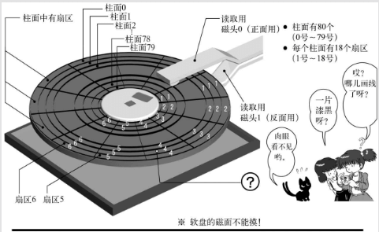

第3天第一部分，对应书上P46-P50
添加的代码，功能是：读取软盘的第二个扇区的内容，到内存0x8200开始的地方
为什么是加载到0x8200这个地方：
0x7c00-0x7dff:ipl(启动引导区)
0x7e00-0x7fff:ipl的数据和堆栈占用
0x8000-0x81ff:ipl的备份占用

计算机启动后，32KB内存的使用情况如下:

```
+--------------------- 0x0
| Interrupts vectors
+--------------------- 0x400
| BIOS data area
+--------------------- 0x5??
| OS load area
+--------------------- 0x7C00
| Boot sector
+--------------------- 0x7E00
| Boot data/stack
+--------------------- 0x7FFF
| (not used)
+--------------------- (...)
```
节选自 http://www.ruanyifeng.com/blog/2015/09/0x7c00.html

至于“INT 0x13”这个指令，我们虽然知道这是要调用BIOS的0x13号函数：
❏ 磁盘读、写，扇区校验（verify），以及寻道（seek）

- AH=0x02;（读盘）
- AH=0x03;（写盘）
- AH=0x04;（校验）
- AH=0x0c;（寻道）
- AL=处理对象的扇区数；（只能同时处理连续的扇区）
- CH=柱面号 &0xff；
- CL=扇区号（0-5位）|（柱面号&0x300）>>2；
- DH=磁头号；
- DL=驱动器号；
- ES:BX=缓冲地址；(校验及寻道时不使用)返回值：
- FLACS.CF==0：没有错误，AH==0
- FLAGS.CF==1：有错误，错误号码存入AH内（与重置（reset）功能一样）



1张软盘有80个柱面，2个磁头，18个扇区，且一个扇区有512字节。所以，一张软盘的容量是：80×2×18×512=1474 560 Byte=1440KB含有IPL的启动区，位于C0-H0-S1（柱面0，磁头0，扇区1的缩写），下一个扇区是C0-H0-S2。这次我们想要装载的就是这个扇区。

到目前为止我们开发的程序完全没有考虑段寄存器，但事实上，不管我们要指定内存的什么地址，都必须同时指定段寄存器，这是规定。一般如果省略的话就会把“DS:”作为默认的段寄存器。以前我们用的“MOV CX, [1234]”，其实是“MOV CX, [DS:1234]”的意思。“MOV AL, [SI]”，也就是“MOV AL, [DS:SI]”的意思。在汇编语言中，如果每回都这样写就太麻烦了，所以可以省略默认的段寄存器DS。因为有这样的规则，所以DS必须预先指定为0，否则地址的值就要加上这个数的16倍，就会读写到其他的地方，引起混乱。